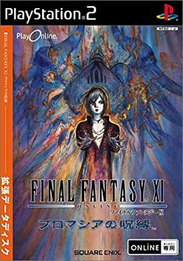

A video project with all (maybe) FFXI mission recorded in details.

The video project is presented by team Daraji. It will cover almost all missions	from original FFXI to Seekers of Adoulin. Enjoy. (*´▽`*) 
Some image files are taken from <a href="http://ffxiclopedia.wikia.com/wiki/Main_Page" target="_blank">ffxiclopedia</a>.
  

 

### San d'Oria
<table style="width:100%">
<tr><th>Mission No.</th><th>Mission Name &#40;En&#41;</th><th>Mission Name &#40;Jp&#41;</th><th>Link</th></tr>
<tr><td>1-1</td><td>Smash the Orcish Scouts</td><td>オークの斥候を倒せ</td><td></td></tr>
<tr><td>1-2</td><td>Bat Hunt</td><td>コウモリ退治</td>
	<td><a href="https://www.youtube.com/watch?v=_zJs610Z19k&list=PLNDJlM0UgRDCGBYYjkDo6PaQ2WFtMJzAy&index=2&t=0s" target="_blank">Youtube</a></td></tr>
<tr><td>1-3</td><td>Save the Children</td><td>子供の救助</td>
	<td><a href="https://www.youtube.com/watch?v=_zJs610Z19k&list=PLNDJlM0UgRDCGBYYjkDo6PaQ2WFtMJzAy&index=2&t=0s" target="_blank">Youtube</a></td></tr>
<tr><td>2-1</td><td>The Rescue Drill</td><td>救助訓練</td>
	<td><a href="https://www.youtube.com/watch?v=qVdeVDbuTJM&list=PLNDJlM0UgRDCGBYYjkDo6PaQ2WFtMJzAy&index=3&t=0s" target="_blank">Youtube</a></td></tr>
<tr><td>2-2</td><td>The Davoi Report</td><td>ダボイ調査報告</td>
	<td><a href="https://www.youtube.com/watch?v=QPNm8B4fWqE&list=PLNDJlM0UgRDCGBYYjkDo6PaQ2WFtMJzAy&index=4&t=0s" target="_blank">Youtube</a></td></tr>
<tr><td>2-3</td><td>Journey Abroad</td><td>他国を回れ</td>
	<td><a href="https://www.youtube.com/watch?v=dNq4ldkQ16M&list=PLNDJlM0UgRDCGBYYjkDo6PaQ2WFtMJzAy&index=5&t=0s" target="_blank">Youtube</a></td></tr>
<tr><td>3-1</td><td>Infiltrate Davoi</td><td>ダボイ潜入計画</td>
	<td><a href="https://www.youtube.com/watch?v=qUdWLIyzE5Q&list=PLNDJlM0UgRDCGBYYjkDo6PaQ2WFtMJzAy&index=6&t=0s" target="_blank">Youtube</a></td></tr>
<tr><td>3-2</td><td>The Crystal Spring</td><td>クリスタルの泉</td>
	<td><a href="https://www.youtube.com/watch?v=pIgQrlulmF0&list=PLNDJlM0UgRDCGBYYjkDo6PaQ2WFtMJzAy&index=7&t=0s" target="_blank">Youtube</a></td></tr>
<tr><td>3-3</td><td>Appointment to Jeuno</td><td>ジュノ大使館へ赴任</td>
	<td><a href="https://www.youtube.com/watch?v=K_wxmaqNjvk&list=PLNDJlM0UgRDCGBYYjkDo6PaQ2WFtMJzAy&index=8&t=0s" target="_blank">Youtube</a></td></tr>
<tr><td>4</td><td>Magicite &#40;San d'Oria&#41;</td><td>魔晶石を奪え</td>
	<td><a href="https://www.youtube.com/watch?v=RS3zxekwSr0&list=PLNDJlM0UgRDCGBYYjkDo6PaQ2WFtMJzAy&index=9&t=0s" target="_blank">Youtube</a></td></tr>
<tr><td>5-1</td><td>The Ruins of Fei'Yin</td><td>廃墟フェ・イン</td>
	<td><a href="https://www.youtube.com/watch?v=Gv__dm3aXJI&list=PLNDJlM0UgRDCGBYYjkDo6PaQ2WFtMJzAy&index=10&t=0s" target="_blank">Youtube</a></td></tr>
<tr><td>5-2</td><td>The Shadow Lord</td><td>闇の王を討て！</td>
	<td><a href="https://www.youtube.com/watch?v=Q3Cz-1Rz8Nc&list=PLNDJlM0UgRDCGBYYjkDo6PaQ2WFtMJzAy&index=11&t=0s" target="_blank">Youtube</a></td></tr>
<tr><td>6-1</td><td>Leaute's Last Wishes</td><td>ローテ王妃の遺言</td>
	<td></td></tr>
<tr><td>6-2</td><td>Ranperre's Final Rest</td><td>龍王の眠る場所</td>
	<td></td></tr>
<tr><td>7-1</td><td>Prestige of the Papsque</td><td>教皇の威信</td>
	<td></td></tr>
<tr><td>7-2</td><td>The Secret Weapon</td><td>獣人兵器の秘密</td>
	<td></td></tr>
<tr><td>8-1</td><td>Coming of Age</td><td>成人の儀</td>
	<td></td></tr>
<tr><td>8-2</td><td>Lightbringer</td><td>聖剣探索</td>
	<td></td></tr>
<tr><td>9-1</td><td>Breaking Barriers</td><td>厚き壁</td>
	<td></td></tr>
<tr><td>9-2</td><td>The Heir to the Light</td><td>光の継承者</td>
	<td></td></tr>
</table>

  
							

 

### Rise of the Zilart
<table style="width:100%">
<tr><th>Mission No.</th><th>Mission Name &#40;En&#41;</th><th>Mission Name &#40;Jp&#41;</th><th>Link</th></tr>
<tr><td>1</td><td>The New Frontier</td><td>新たなる世界</td>
	<td><a href="https://www.youtube.com/watch?v=RXiEYONlHmk&index=14&list=PLNDJlM0UgRDCGBYYjkDo6PaQ2WFtMJzAy&t=0s" target="_blank">Youtube</a></td></tr>
<tr><td>2</td><td>Welcome t'Norg</td><td>海賊の巣窟ノーグ</td>
	<td><a href="https://www.youtube.com/watch?v=1z-SfTqsVvE&index=15&list=PLNDJlM0UgRDCGBYYjkDo6PaQ2WFtMJzAy&t=0s" target="_blank">Youtube</a></td></tr>
<tr><td>3</td><td>Kazham's Chieftainess</td><td>カザム族長</td>
	<td></td></tr>
<tr><td>4</td><td>The Temple of Uggalepih</td><td>ウガレピ寺院</td>
	<td></td></tr>
<tr><td>5</td><td>Headstone Pilgrimage</td><td>古代石碑巡礼</td>
	<td></td></tr>
<tr><td>6</td><td>Through the Quicksand Caves</td><td>流砂洞を越えて</td>
	<td></td></tr>
<tr><td>7</td><td>The Chamber of Oracles</td><td>宣託の間</td>
	<td></td></tr>
<tr><td>8</td><td>Return to Delkfutt's Tower</td><td>デルクフの塔再び</td>
	<td></td></tr>
<tr><td>9</td><td>Ro'Maeve</td><td>ロ・メーヴ</td>
	<td></td></tr>
<tr><td>10</td><td>The Temple of Desolation</td><td>聖地ジ・タ～滅びの神殿</td>
	<td></td></tr>
<tr><td>11</td><td>The Hall of the Gods</td><td>神々の間</td>
	<td></td></tr>
<tr><td>12</td><td>The Mithra and the Crystal</td><td>ミスラとクリスタル</td>
	<td></td></tr>
<tr><td>13</td><td>The Gate of the Gods</td><td>神の扉トゥー・リア</td>
	<td></td></tr>
<tr><td>14</td><td>Ark Angels</td><td>アーク・ガーディアン</td>
	<td></td></tr>
<tr><td>15</td><td>The Sealed Shrine</td><td>閉ざされし門</td>
	<td></td></tr>
<tr><td>16</td><td>The Celestial Nexus</td><td>宿星の座</td>
	<td></td></tr>
<tr><td>17</td><td>Awakening</td><td>1万年の夢の終わりに</td>
	<td></td></tr>
<tr><td>18</td><td>The Last Verse</td><td>すべての終わりが閉ざされん</td>
	<td></td></tr>
</table>
  
							

 

### Chains of Promathia
<table style="width:100%">
<tr><th>Mission No.</th><th>Mission Name &#40;En&#41;</th><th>Mission Name &#40;Jp&#41;</th><th>Link</th></tr>
<tr class='border_top'><td>1-1</td><td>The Rites of Life</td><td>命の洗礼</td>
	<td rowspan='3'><a href='https://youtu.be/o-jjhLjE-oU' target='_blank'>Youtube</a></td></tr>
<tr><td>1-2</td><td>Below the Arks</td><td>楼閣の下に</td></tr>
<tr><td>1-3</td><td>The Mothercrystals</td><td>母なる石</td></tr>
<tr class='border_top'><td>2-1</td><td>An Invitation West</td><td></td>
	<td rowspan='5'><a href='https://youtu.be/B6t10Wd5wTY' target='_blank'>Youtube</a></td></tr>
<tr><td>2-2</td><td>The Lost City</td><td></td></tr>
<tr><td>2-3</td><td>Distant Beliefs</td><td></td></tr>
<tr><td>2-4</td><td>An Eternal Melody</td><td></td></tr>
<tr><td>2-5</td><td>Ancient Vows</td><td></td></tr>
<tr class='border_top'><td>3-1</td><td>The Call of the Wyrmking</td><td></td>
	<td rowspan='5'><a href='https://youtu.be/lbEm63Q9Yrc' target='_blank'>Youtube</a></td></tr>
<tr><td>3-2</td><td>A Vessel Without a Captain</td><td></td></tr>
<tr><td>3-3</td><td>The Road Forks</td><td></td></tr>
<tr><td>3-4</td><td>Tending Aged Wounds</td><td></td></tr>
<tr><td>3-5</td><td>Darkness Named</td><td></td></tr>
<tr class='border_top'><td>4-1</td><td>Sheltering Doubt</td><td></td>
	<td rowspan='4'><a href=' https://youtu.be/e_AINo94HL8' target='_blank'>Youtube</a></td></tr>
<tr><td>4-2</td><td>The Savage</td><td></td></tr>
<tr><td>4-3</td><td>The Secrets of Worship</td><td></td></tr>
<tr><td>4-4</td><td>Slanderous Utterings</td><td></td></tr>
<tr class='border_top'><td>5-1</td><td>The Enduring Tumult of War</td><td></td>
	<td rowspan='3'><a href='https://youtu.be/Ejk0mwJkB2Q' target='_blank'>Youtube</a></td></tr>
<tr><td>5-2</td><td>Desires of Emptiness</td><td></td></tr>
<tr><td>5-3</td><td>Three Paths</td><td></td></tr>
<tr class='border_top'><td>6-1</td><td>For Whom the Verse is Sung</td><td></td>
	<td rowspan='4'><a href='https://youtu.be/stbKTinkiIs' target='_blank'>Youtube</a></td></tr>
<tr><td>6-2</td><td>A Place to Return</td><td></td></tr>
<tr><td>6-3</td><td>More Questions Than Answers</td><td></td></tr>
<tr><td>6-4</td><td>One to be Feared</td><td></td></tr>
<tr class='border_top'><td>7-1</td><td>Chains and Bonds</td><td></td>
	<td rowspan='5'><a href='https://youtu.be/5Gv1yzC9Jt8' target='_blank'>Youtube</a></td></tr>
<tr><td>7-2</td><td>Flames in the Darkness</td><td></td></tr>
<tr><td>7-3</td><td>Fire in the Eyes of Men</td><td></td></tr>
<tr><td>7-4</td><td>Calm Before the Storm</td><td></td></tr>
<tr><td>7-5</td><td>The Warrior's Path</td><td></td></tr>
<tr class='border_top'><td>8-1</td><td>The Garden of Antiquity</td><td></td>
	<td rowspan='5'>
		<a href='#'>Youtube</a> 
		<a href='#'>Onedrive(No sound but with full battle)</a>
	</td></tr>
<tr><td>8-2</td><td>A Fate Decided</td><td></td></tr>
<tr><td>8-3</td><td>When Angels Fall</td><td></td></tr>
<tr><td>8-4</td><td>Dawn</td><td></td></tr>
<tr><td>8-5</td><td>The Last Verse</td><td></td></tr>
<tr class='border_top'><td rowspan='4'>Epilogue</td><td>Storms of Fate</td><td></td>
	<td rowspan='4'><a href='#'>Youtube</a> </td></tr>
<tr><td>Shadows of the Departed</td><td></td></tr>
<tr><td>Apocalypse Nigh</td><td></td></tr>
<tr><td>The Last Verse</td><td></td></tr>
</table>
  
							

 

### Treasures of Aht Urhgan
<table style="width:100%">
<tr><th>Mission No.</th><th>Mission Name &#40;En&#41;</th><th>Mission Name &#40;Jp&#41;</th><th>Link</th></tr>
<tr class='border_top'><td>1</td><td>Land of Sacred Serpents</td><td></td>
	<td rowspan='7'><a href='#'>Youtube</a></td></tr>
<tr><td>2</td><td>Immortal Sentries</td><td></td></tr>
<tr><td>3</td><td>President Salaheem</td><td></td></tr>
<tr><td>4</td><td>Knight of Gold</td><td></td></tr>
<tr><td>5</td><td>Confessions of Royalty</td><td></td></tr>
<tr><td>6</td><td>Easterly Winds</td><td></td></tr>
<tr><td>7</td><td>Westerly Winds</td><td></td></tr>
<tr class='border_top'><td>8</td><td>A Mercenary Life</td><td></td>
	<td rowspan='10'><a href='#'>Youtube</a></td></tr>
<tr><td>9</td><td>Undersea Scouting</td><td></td></tr>
<tr><td>10</td><td>Astral Waves</td><td></td></tr>
<tr><td>11</td><td>Imperial Schemes</td><td></td></tr>
<tr><td>12</td><td>Royal Puppeteer</td><td></td></tr>
<tr><td>13</td><td>Lost Kingdom</td><td></td></tr>
<tr><td>14</td><td>The Dolphin Crest</td><td></td></tr>
<tr><td>15</td><td>The Black Coffin</td><td></td></tr>
<tr><td>16</td><td>Ghosts of the Past</td><td></td></tr>
<tr><td>17</td><td>Guests of the Empire</td><td></td></tr>
<tr class='border_top'><td>18</td><td>Passing Glory</td><td></td>
	<td rowspan='7'><a href='#'>Youtube</a></td></tr>
<tr><td>19</td><td>Sweets for the Soul</td><td></td></tr>
<tr><td>20</td><td>Teahouse Tumult</td><td></td></tr>
<tr><td>21</td><td>Finders Keepers</td><td></td></tr>
<tr><td>22</td><td>Shield of Diplomacy</td><td></td></tr>
<tr><td>23</td><td>Social Graces</td><td></td></tr>
<tr><td>24</td><td>Foiled Ambition</td><td></td></tr>
<tr class='border_top'><td>25</td><td>Playing the Part</td><td></td>
	<td rowspan='8'><a href='#'>Youtube</a></td></tr>
<tr><td>26</td><td>Seal of the Serpent</td><td></td></tr>
<tr><td>27</td><td>Misplaced Nobility</td><td></td></tr>
<tr><td>28</td><td>Bastion of Knowledge</td><td></td></tr>
<tr><td>29</td><td>Puppet in Peril</td><td></td></tr>
<tr><td>30</td><td>Prevalence of Pirates</td><td></td></tr>
<tr><td>31</td><td>Shades of Vengeance</td><td></td></tr>
<tr><td>32</td><td>In the Blood</td><td></td></tr>
<tr class='border_top'><td>33</td><td>Sentinels' Honor</td><td></td>
	<td rowspan='5'><a href='#'>Youtube</a></td></tr>
<tr><td>34</td><td>Testing the Waters</td><td></td></tr>
<tr><td>35</td><td>Legacy of the Lost</td><td></td></tr>
<tr><td>36</td><td>Gaze of the Saboteur</td><td></td></tr>
<tr><td>37</td><td>Path of Blood</td><td></td></tr>
</table>
  