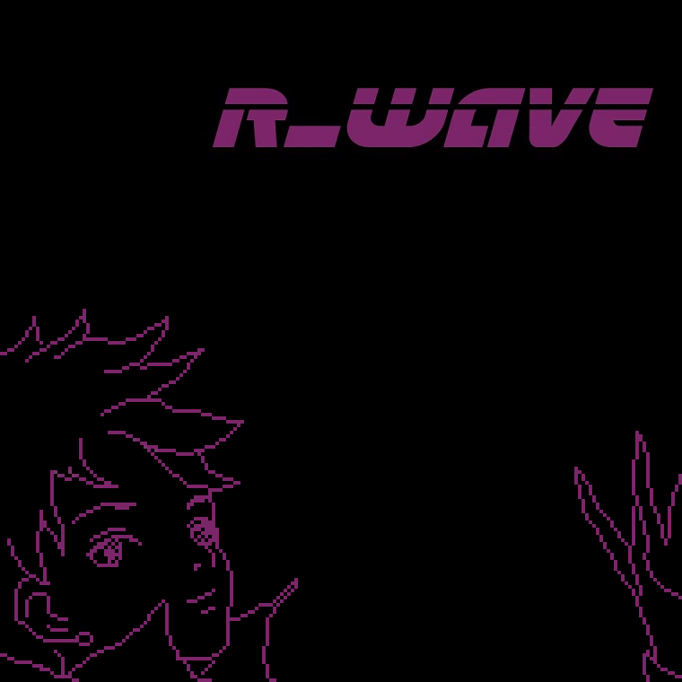

Last month I was listening R4's OST, occasionally did some playback speed tricks and found some tracks sounds fantastic even at 0.75x speed.

### Track List
##### 01 Now Loading
<audio id="audio" controls="" preload="none">
<source id="mp3" src="../music/remix/R_WAVE/01 Now Loading.mp3" type="audio/mpeg">
</audio>

##### 02 Departure Lounge (Λ5TRθN Chill RMX)
<audio id="audio" controls="" preload="none">
<source id="mp3" src="../music/remix/R_WAVE/02 Departure Lounge.mp3" type="audio/mpeg">
</audio>

##### 03 Grip (Λ5TRθN Breakbeat RMX)
<audio id="audio" controls="" preload="none">
<source id="mp3" src="../music/remix/R_WAVE/03 Grip.mp3" type="audio/mpeg">
</audio>

##### 04 Motor Species (Λ5TRθN Psywave RMX)
<audio id="audio" controls="" preload="none">
<source id="mp3" src="../music/remix/R_WAVE/04 Motor Species.mp3" type="audio/mpeg">
</audio>

##### 05 Pearl Blue Soul (Λ5TRθN Neon Funk Edit)
<audio id="audio" controls="" preload="none">
<source id="mp3" src="../music/remix/R_WAVE/05 Pearl Blue Soul.mp3" type="audio/mpeg">
</audio>

##### 06 Quiet Curves (Λ5TRθN Chill RMX)
<audio id="audio" controls="" preload="none">
<source id="mp3" src="../music/remix/R_WAVE/06 Quiet Curves.mp3" type="audio/mpeg">
</audio>

### Links
* YouTube: [https://youtu.be/TGh8tRi6Xyg](https://youtu.be/TGh8tRi6Xyg)
* Bandcamp: [http://astroneko404.bandcamp.com/album/-](http://astroneko404.bandcamp.com/album/-)

### Special Thanks
Appreciate the help from Jing.W for the cover image design

### Resources
* Font used in the cover design:
[https://www.fontspace.com/laser-corps-font-f46094](https://www.fontspace.com/laser-corps-font-f46094)
* Midi source for Quiet Curves: [https://www.youtube.com/watch?v=jAZw7EAY408](https://www.youtube.com/watch?v=jAZw7EAY408)
