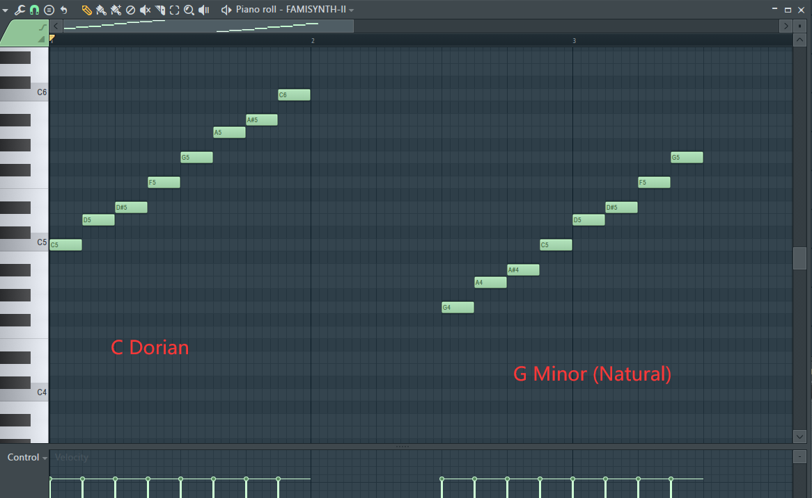

Krumhansl-Schmuckler algorithm is a key finding algorithm based on pitch class distribution, that calculates the correlation between the pitch class distribution array, and each of the 12 major and 12 minor profile weights.

The full Python code could be found on <a href="https://gist.github.com/Astroneko404/1dcde11576e510e964882bbbafaeb050" target="_blank">my GH Gist</a>.

## Retrieve Pitch Class Distribution from MIDI
Let's use the main theme music of Metro-Cross as an example, and it's MIDI file could be downloaded <a href="http://www5.plala.or.jp/m5ka1/memo/midiroom/mtrcrsr1.zip" target="_blank">here</a>:
<iframe width="560" height="315" src="https://www.youtube.com/embed/qh2jOHHsQms" title="YouTube video player" frameborder="0" allow="accelerometer; autoplay; clipboard-write; encrypted-media; gyroscope; picture-in-picture" allowfullscreen></iframe>

(Spoiler: It's in A minor.)

First we use <a href="https://mido.readthedocs.io/en/latest/index.html" target="_blank">mido</a> to read the MIDI file:


from mido import MidiFile
midi_file = MidiFile("[midi]/metro_cross_main.mid")


then retrieve the MIDI notes:


def getAllMidiNotes(mid: MidiFile):
    """
    Retrieve midi note information
    :param mid: mido MidiFile
    :return: A list containing all motes with their midi notes number and time
    """
    midi_notes = []
    for track in mid.tracks:
        for msg in track:
            msg_dict = msg.dict()
            if msg_dict["type"] == "note_on" and msg_dict["channel"] != 9:  # Remove the percussion channel
                midi_notes.append([msg_dict["note"], msg_dict["time"]])
    return midi_notes


Each `msg_dict` looks like this:


{'type': 'note_off', 'time': 340, 'note': 48, 'velocity': 80, 'channel': 2}


Remember that the 10th channel is reserved for percussion, so we need to exclude this channel before extracting all notes.

After retrieving all notes, we calculate the pitch class distribution vector:


def getPitchDuration(note_list):
    """
    Calculate the duration of each pitch class
    :param note_list: The list returned by getAllMidiNotes
    :return: Pitch duration array for Pearson correlation calculation
    """
    pitch_duration = [0 for _ in range(12)]
    for note, length in note_list:
        pitch_duration[note % 12] += length
    return pitch_duration


## Key-Profile Weights
There are 5 different key-profile weights available in <a href="https://web.mit.edu/music21/doc/moduleReference/moduleAnalysisDiscrete.html#krumhanslschmuckler" target="_blank">music21</a>: SimpleWeights, AardenEssen, BellmanBudge, KrumhanslSchmuckler, and TemperleyKostkaPayne, and their characteristics are explained in <a href="http://extras.humdrum.org/man/keycor/" target="_blank">keycor manpage</a>:
>Krumhansl-Kessler:
>
>Strong tendancy to identify the dominant key as the tonic.
>
>Aarden-Essen:
>
>Weak tendancy to identify the subdominant key as the tonic.
>
>Bellman-Budge:
>
>No particular tendancies for confusions with neighboring keys.
>
>Temperley-Kostka-Payne:
>
>Strong tendancy to identify the relative major as the tonic in minor keys. Well-balanced for major keys.
>
>Simple:
>
>Performs most consistently with large regions of music, becomes noiser with smaller regions of music.

Those key-profile weights could be retrieved using music21:


a = analysis.discrete.KrumhanslSchmuckler()
len(a.getWeights('major'))


However, since they are arrays we could define them as global variables:


KRUMHANSL_SCHMUCKLER_MAJOR = [6.35, 2.23, 3.48, 2.33, 4.38, 4.09, 2.52, 5.19, 2.39, 3.66, 2.29, 2.88]
KRUMHANSL_SCHMUCKLER_MINOR = [6.33, 2.68, 3.52, 5.38, 2.6, 3.53, 2.54, 4.75, 3.98, 2.69, 3.34, 3.17]


The original major weights are for C major. In order to get the weights for C# major, we simply shift one element to the right, so the array becomes like this:


[2.88, 6.35, 2.23, 3.48, 2.33, 4.38, 4.09, 2.52, 5.19, 2.39, 3.66, 2.29]


Before we use Pearson correlation to calculate the result, let's define an array that stores the order of different modes so the code part will not be confusing:


MODE_TABLE = [
    "C Major", "C Minor", "C# Major", "C# Minor", "D Major", "D Minor", "D# Major", "D# Minor", "E Major",
    "E Minor", "F Major", "F Minor", "F# Major", "F# Minor", "G Major", "G Minor", "G# Major", "G# Minor",
    "A Major", "A Minor", "A# Major", "A# Minor", "B Major", "B Minor"
]



def DeterminateKey(midi_file):
    """
    Use weights to perform key determination
    :param midi_file: mido MidiFile
    :return: Pearson correlation result (in list)
    """
    note_length_vector = getPitchDuration(getAllMidiNotes(midi_file))
    corr_res = []

    for idx in range(24):
        shift_idx = 12 - idx // 2
        weight = KRUMHANSL_SCHMUCKLER_MAJOR[shift_idx:] + \
        KRUMHANSL_SCHMUCKLER_MAJOR[:shift_idx] if idx % 2 == 0 else \
        KRUMHANSL_SCHMUCKLER_MINOR[shift_idx:] + KRUMHANSL_SCHMUCKLER_MINOR[:shift_idx]
        corr_res.append(pearsonCorrelation(note_length_vector, weight))
    return corr_res


Finally, the index of the maximum value in `corr_res` indicates the most likely mode of our MIDI file:


res = DeterminateKey(midi)
print(MODE_TABLE[argmax(res)])


However, the correlation result using Krumhansl-Kessler weights shows that this music is in E major, but as its characteristic mentions, it tends to "identify the dominant key as the tonic".

Let's try another set of weights:


BELLMAN_BUDGE_MAJOR = [16.8, 0.86, 12.95, 1.41, 13.49, 11.93, 1.25, 20.28, 1.8, 8.04, 0.62, 10.57]
BELLMAN_BUDGE_MINOR = [18.16, 0.69, 12.99, 13.34, 1.07, 11.15, 1.38, 21.07, 7.49, 1.53, 0.92, 10.21]


This time the result shows A minor, which is correct.

## Limitations
Of course there are other modes besides major and minor:
<iframe width="560" height="315" src="https://www.youtube.com/embed/3BZm1i4QdcU" title="YouTube video player" frameborder="0" allow="accelerometer; autoplay; clipboard-write; encrypted-media; gyroscope; picture-in-picture" allowfullscreen></iframe>

This music is in C <a href="https://en.wikipedia.org/wiki/Dorian_mode" target="_blank">Dorian</a>, but if we use this algorithm and Bellman-Budge weights to calculate its key, the result is G minor.

We could simply find that C Dorian and G natural minor share a same set of notes:

Even so, they are two modes that are totally different.

Besides, a song may change its modes several times. Without windowing the inputs, the result may not be precise also.

## References
* <a href="https://web.mit.edu/music21/doc/moduleReference/moduleAnalysisDiscrete.html" target="_blank">https://web.mit.edu/music21/doc/moduleReference/moduleAnalysisDiscrete.html</a>
* <a href="http://extras.humdrum.org/man/keycor/" target="_blank">http://extras.humdrum.org/man/keycor/</a>
