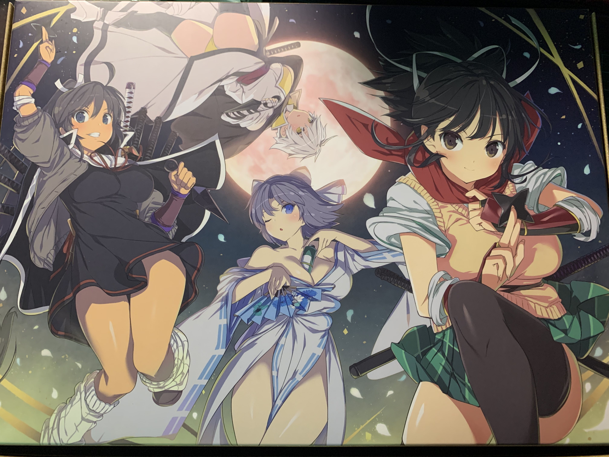
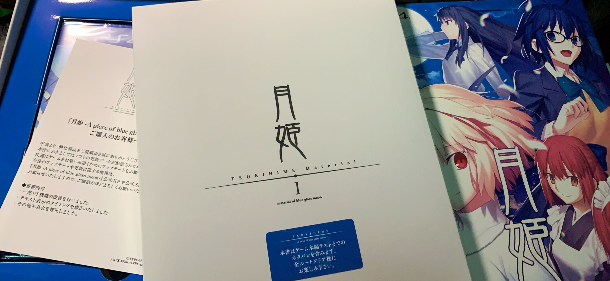

Original post:  
[https://forum.psnprofiles.com/topic/81083-astray404s-trophy-shelf/](https://forum.psnprofiles.com/topic/81083-astray404s-trophy-shelf/)

## #191 - STEINS;GATE ELITE
*Difficulty: 1/10*

Haven't played the original STEINS;GATE yet, but this is more like a Director's Cut Edition of the anime. It's not bad actually, however, although I still need to play the original version on my Vita, since I've heard that there are storywise differences between those two games.

## #192 - Fate/stay night [Realta Nua]
*Difficulty: 2/10*

It is hard to review this in 2022, really.

Back in the 2000s, it was a great visual novel commercially released by Type-Moon, with a proper storyline. Although its straightforward story was not as solid as Kara no Kyoukai (nor Tsukihime), which Kinoko Nasu also wrote, when compared to its Anime movie adaptations, it offers more textual details. I've already played it years ago on PS2, so I skipped most stories on this PS Vita version. The new PS Vita version offers full voice (like the PS2 version), new opening movies, and a new arrangement of BGMs (although it still sounds awful), making the reading experience a lot better. The only horrible thing is collecting all events: without an informational guide, it's like achieving 200.6% area completion in Castlevania SotN. This is why I gave it a 2/10 on difficulty instead of 1.

\+ Story

\+ Full voice

\+ New opening movie

\- Frustrating all-event trophy

\- Music

## #193 - Wattam
*Difficulty: 4/10*

What a shitty game... and I'm not joking. (′゜ω。‵)

It is hard to not compare Wattam with other Namco titles such as Katamari and Noby Noby Boy since these games are developed by the same game producer. This game shows creativity in gameplay, art, and music. It is fun to switch between different characters to solve the puzzle, or wander between islands. The prince and Noby Noby Boy serve as easter eggs at the end of the game although I'm not surprised when found them. Trophies are also straightforward and not grindy.

However, indie games are usually glitchy, and so does this. First, there's a frequent framerate drop during gameplay, and while there are too many characters on one island, there is a possibility that the game will crash. Sometimes small-size characters will stick with the toilet in a glitchy way, making the flush difficult. Besides, there's a chance that the snowman will disappear and you will not be able to obtain the trophy "Struck Gold" unless starting a new game. I would suggest using the tree to transform the snowman into a fruit or mushroom to reduce the chance of glitches.

Overall I would not recommend this game if you are looking for an easy-plat game, but if you are looking for a game to relax, this could be a good choice.

## #194 - Neptunia X Senran Kagura Ninja Wars
*Difficulty: 4/10*

Can't say it's difficult based on the 1.04 version, but those Yomi trials might be challenging for characters that are not lv 50, especially for those who have low defense stats such as Noire and Goh.

The story is not as enjoyable as previous Senran Kagura titles, and it is short. It only took me around 7-8 hrs to finish the main story, and 15 hrs to obtain the plat trophy. Besides, the whole system is a little bit boring (in my own opinion) since it relies on Spirit Gems, which could be upgraded only using gems in the same category, and you'll need to grind a lot.

Basically, it is a good game to kill time, but even so, I highly recommend buying this during a sale.

BTW, the box edition looks nice.

## #195 Tsukihime -A piece of blue glass moon-
*Difficulty: 1/10*

Thank TYPE-MOON for bringing everyone back to the golden age of Visual Novels. Although it only contains half of the original story, it took me almost around 40+ hours to read stories from all 2 routes.

Don't get deceived by the first playthrough, since Arcueid's route conceals all conspiracies with a "boy-meet-girl" romantic facade. Once getting into Ciel's route during the second playthrough, the distinct "TYPE-MOON" -ish complexity of the story starts to show up. Even bad endings are fun to watch instead of frustrating and punishing readers.

I wish not to spoil the whole story, so my review of the story ends here. If you possess the ability to read in Japanese, I would highly recommend this, and also Tsukihime -The other side of red garden-, which will be released in the future.

## #196 - Final Fantasy (Pixel Remaster)
*Difficulty: 3/10*

Already played this many years ago on my GBA when I was a kid, and I still remember that it took me an afternoon to level up my characters and yet I'm not even to reach the deepest floor in Cavern of Earth. Somehow levelling in old FF titles makes me frustrated and give up playing easily, especially when saving the game is only available in the field.

Revisiting this game in the FFPR bundle brings new experiences, especially when I discovered the contents I missed. Booth and auto-save are definitely live-saver. Although bonus dungeons and Labyrinth of Time are missing, the gameplay is still enjoyable.

## #197 - Final Fantasy II (Pixel Remaster)
*Difficulty: 3/10*

Now it’s time for enjoying the most innovative and controversial one among the whole FF series. IIRC this game did receive mixed reviews back when released, mostly due to its new EXP and growth system.

\+ Great story, probably the best one in the Famicom trilogy

\+ Great music

\+ Using MP to release magic instead of limiting the number of uses (I’m really not into the DND system)

\+ Chocobos

\- Although the new weapon skill level system is acceptable for me, the weapon exp indicator is obscure and does not show how far have I progressed and how many left to level up (I would say that FF11 has a much better weapon skill system but this game is 14 years later than FF2)

\- Easily getting one-hit killed because of accidentally stepping in high-level areas on the world map (imagine visiting the desert by mistake at the start of the game and getting killed instantly by the Antlion thing), and there is no gaming mechanics to prevent me from doing this, nor signs marking area levels. Thankfully, the auto-save could save lots of time on trial-and-errors

\- Normal random battles are being triggered too frequently. Once every 5 or 6 seconds a normal random battle will start, forcing me to turn off encounters

\- Messy bestiary due to its sorted by creature types instead of spawn location by default. It's horrible for trophy hunters

\- Story-wise, guest NPCs keep sacrificing themselves and it almost turns into something cliche

## #198 - Final Fantasy III (Pixel Remaster)
*Difficulty: 4/10*

With a more advanced job system, once again, 4 warriors of light are saving the world... again. Overall the gameplay is more enjoyable than FF2, though it is slightly more challenging due to its unique gameplay designs.

\+ New job system. More jobs and more fun!

\+ Free to switch between jobs. It gives me more freedom in gameplay, especially when caster characters run out of MP in the dungeon. Being able to switch to melee jobs at least is a choice to let those characters have some damage output

\+ Large world map. The floating continent is actually a small part of the world map! Besides, finding that the airship could travel undersea brings fresh experience.

\+ Free HP/MP recovering service after getting the Invincible

\+ Bosses are more challenging and fun to fight

\- Unlike FF1, there is no Ether for MP (more appropriate, spell usage) recovering, which means you will have to be prudent and conservative on magic spells usage, especially in dungeons. It just considerably limits the damage output of magic-oriented jobs such as black mage and magus. This is the main reason why I rate FF3 as 4/10 on the difficulty

\- MP will be emptied upon job switching

\- You will need to grind a lot to level up your characters. Not only for character leveling but also for job leveling, and there are specific dungeons that force you to switch to a specific job, forcing you to do some job leveling work

## #199 - Senran Kagura Bon Appetit! (Physical Version)
*Difficulty: 2/10*

The joysticks on my vita got drifting badly but fortunately I'm still able to plat this.

I have to say that it requires lots of grinding... Clearing 200 songs is too much.

Checking the trophy records of the digital version of this game makes me wonder how I beat all songs on Hard mode since I probably did not know the cheat code back then... (:hmm:)

## #200 - Final Fantasy IV (Pixel Remaster)
*Difficulty: 3/10*

200th platinum!

As the first FF on Super Nintendo, the music, art and story are much better than previous ones, and its gameplay also evolved in a fantastic way. It's a good start on SNES.

\+ Thanks to the new ATB system and the inclusion of more battle gimmicks, battles now bring more excitement and surprises. Almost every boss has absorbing or countering, such as Mist Dragon and Rubicante. It takes turns to figure out a proper time to attack, and the most efficient strategy to defeat the boss without reading a walkthrough guide

\+ A fantastic story and character depiction, although cutscenes appear slightly too much

\+ The world map, including the above-ground world, the underground world and the moon, is definitely fun to explore

\+ Save points in dungeons. What a lifesaver!

\- Lacking a job system makes the game more story-focused. Sometimes I wish Cecil could switch his job between Dark Knight and Paladin, and the usage of his jobs brings different endings

\- Requiring lots of grindings. I'm not a victim of stupid RNG but I've heard that it might take hours to farm summon magics and the pink tail
