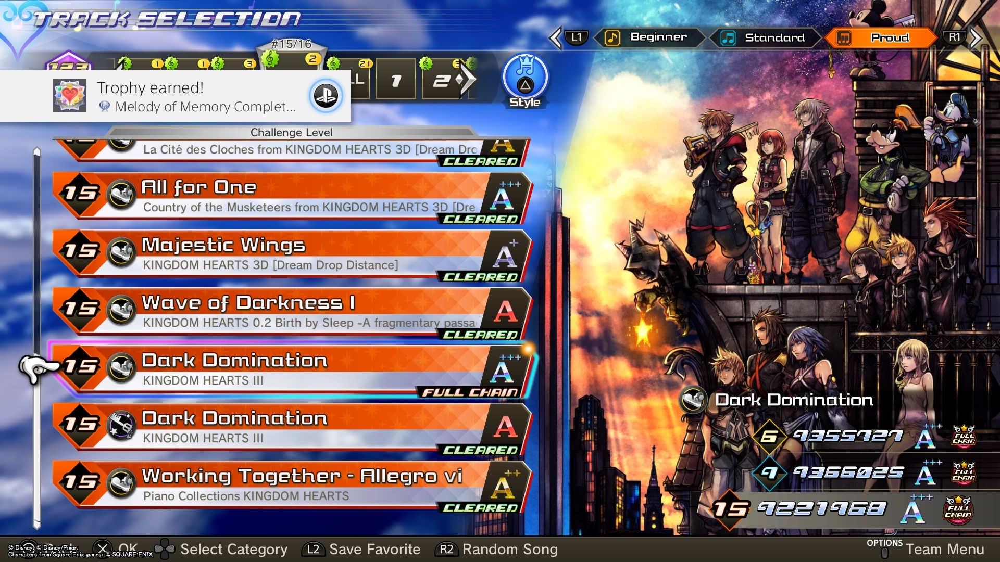

---
title: PSN Platinum Trophy Thoughts No.201 - No.210
layout: post
tags: Game PlayStation
permalink: /posts/:title/
date: 2024-3-20
---

Original post:  
[https://forum.psnprofiles.com/topic/81083-astray404s-trophy-shelf/](https://forum.psnprofiles.com/topic/81083-astray404s-trophy-shelf/)

## #201 - The Gardens Between
*Difficulty: 2/10*

It is a lovely indie puzzle game with adorable graphics that took me around 2.5hrs to finish. A good choice to kill time.

\+ Player-friendly control and easy-to-follow tutorial. Although the whole game does not contain a single word, unlike those games that have a redundant paragraph to introduce, the tutorial is smooth and comprehensive

\+ Graphics and scene design. Each island has its unique landscape that is related to the puzzle, such as the dinosaur skeleton that could change the path

\- Since it lacks storytelling, the whole story is confusing until the end of the game

## #202 - Life is Strange: True Colors
*Difficulty: 3/10*

Last night I thought that I could quickly plat this game and go to bed, but I never expected it to end in spending almost an hour to figure out how to make the game not crash at the last cutscene. This game quality is not worth 60 bucks, though I got it from the PS+ collections.

\+ The story compared to LIS 2 is much better, at least there is no subjective political bias shit stuffed everywhere in the main story. It has a great start, and the girl's motive to search for the killer of her brother sounds reasonable. Although the character depiction in Chapter 5 is not as amazing as in LIS 1, it is still stunning.

\+ The role-playing gaming part in Chapter 3 is a fresh experience and it is enjoyable.

\- The game keeps crashing during the last cutscene, which is definitely unacceptable, given there are lots of QA specialists displayed in the credit list.

\- Boring music. It would be better if they could use something else that is not an acoustic guitar.

\- Exactly 731. Using the number 731 to imply some teasing should be okay somewhere like 4chan, but this kind of humor is not suitable for a formal place such as console games.

## #203 - Kingdom Hearts Melody of Memory
*Difficulty: 3/10*

I don't think that this game is difficult, although the trophy Proud Chain Master may sound scary at first glance.

Overall it is not bad, but compared to the Theatrhythm series it looks a little bit mediocre.

\+ 150 songs covering from KH1 to KH3

\+ The addition of a One-button mode might be useful for someone who doesn't have much experience with rhythm games

\- Although each team has its HP and other stats, the battle system is not "RPG" enough, especially when compared to Theatrhythm series, since there is no actual combat scene

\- Maps are hard to read, and since orchestra music usually changes bpm every bar, it is challenging to determine when to press the button

\- Clearing all 450 maps and defeating 100k-enemy are too grindy, forcing players to spend more time on the game

## #204 - Unpacking
*Difficulty: 1/10*

Ｄｏｅｓ　ｃｏｎｓｕｍｅｒｉｓｍ　ｅｎｔｉｃｅ　ｕｓ　ｉｎｔｏ　ｕｎｌｉｍｉｔｅｄ　ｐｕｒｃｈａｓｉｎｇ？

Anyway, with the accessibility feature on, it is just a clicking simulator, although the art style looks cute. 

## #205 - Last Stop
*Difficulty: 2/10*

The last chapter is totally beyond my expectations, and it does not seem to connect well with the preceding contents. Kinda weird.

## #206 - LEGO The Incredibles
*Difficulty: 4/10*

My turbo controller saved my life again.

Like other Lego games, this game is pretty glitchy, but overall it's not that awful. 

\+ Everything adapted from the movies is awesome (story, music, etc)

\- If you enter the game before downloading complete, you will enter a lava scene. Although it is a good place for That Was Totally Wicked!, there is no description, which may cause confusion

\- Loading time. It takes forever to return to the city

\- Nasty glitches, especially in chapter 8. Your characters will stuck in the ground, silver safe with the minikit cannot be bombed, etc. Restart the level will somehow solve those problems, but it is frustrating

## #207 - Stranger of Paradise: Final Fantasy Origin
*Difficulty: 4/10*

Similar to FF14, this game gave me the feeling of a Final Fantasy theme park, with stage designs that are inspired by previous FF titles such as FF14, FF13, FF11, etc. The battle system is solid as usual. However, as its weak spot, the storytelling is not appealing enough.

\+ Job system and weapon system enrich the gaming experience, although I would prefer using mages

\+ Boss battles are fun to play, and it is challenging to beat them in Chaos mode, although I still cannot beat Tiamat even in Action mode, and I don't get it :(

\+ Music

\- Equipment grinding makes it like a Sagyō game. Running through stages just for high-level equipment is kinda frustrating, but the game forces players to do so

\- Offline experience is not as cheesy as online experience since the game allows using Phoenix Downs on your player when playing with others

## #208 - Romancing SaGa 2 (AS)
*Difficulty: 4/10*

It was the second time that I finished this game, but this time I tried to finish it in a more challenging way, and I found it doable to just plat this game in only one playthrough. Will start writing the trophy guide soon. (Update: guide here)

\+ Open world & open event system -> careful, this game's gotta softlock you everywhere

\+ Music

\+ A new maze was added in the remastered version

\- Although the game displays every mob's location (unlike FF), it's frustrating 

## #209 - Final Fantasy VII Remake (PS5)
*Difficulty: 1/10*

Have to say that the savefile transferring is much better than Elden Ring 🤣

## #210 - Apollo Justice: Ace Attorney
*Difficulty: 2/10*

An amazing 40-hour experience with 3 titles introducing Apollo Justice, which makes the characterization of AJ much better than Phoenix Wright.

\+ The power of lines. Although there are no fancy and complicated cutscenes, what characters speak represents their personalities and positions, moving the story along nicely

\+ Superficial elements may cause lacking rigour, but they make the story more enjoyable.

\+ Amazing music, especially AA6

\- In AA6, objects are hard to point out during the ceremony